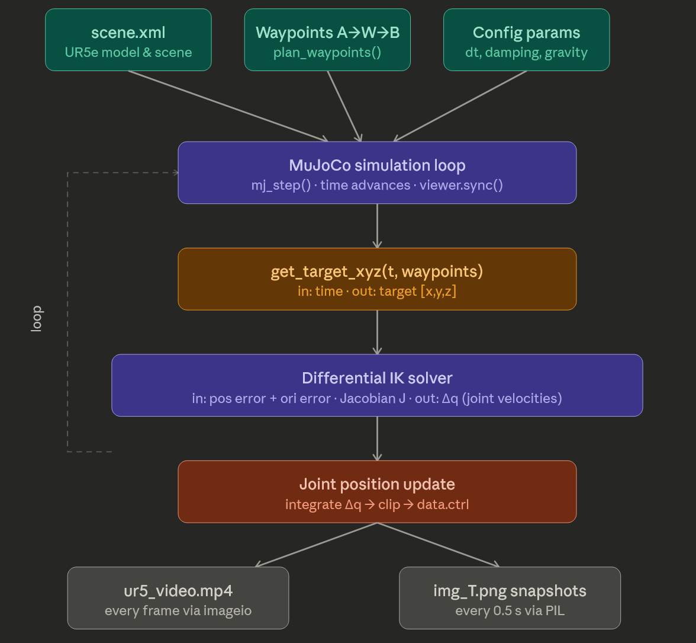

# Tabletop Robot VQA Control

A minimal example of controlling a tabletop robotic manipulation task using a **Vision-Language Model (VLM)** through **Visual Question Answering (VQA)**.

The robot observes the scene, answers structured questions about the environment, and converts those answers into executable actions.

## Robot


## Idea

1. Capture an image of the scene.
2. Ask the VLM task-relevant questions.
3. Convert the answer into a structured state.
4. Plan an action.
5. Execute with the robot controller.
6. Repeat until the task is completed.

## Example Loop

```python
img = camera.capture()

question = "Is the red block inside the bowl?"
answer = vlm.ask(img, question)

state = parse(answer)
action = policy(state)

robot.execute(action)
```

## Applications

* Tabletop manipulation
* Pick-and-place tasks
* Spatial reasoning experiments
* VLM-based robot planning


## UR5 Null Space Control


Implements differential inverse kinematics with null space control on a UR5e arm in MuJoCo. The end-effector tracks a waypoint trajectory while avoiding a spherical obstacle, with joint velocities solved via a damped pseudoinverse Jacobian.
