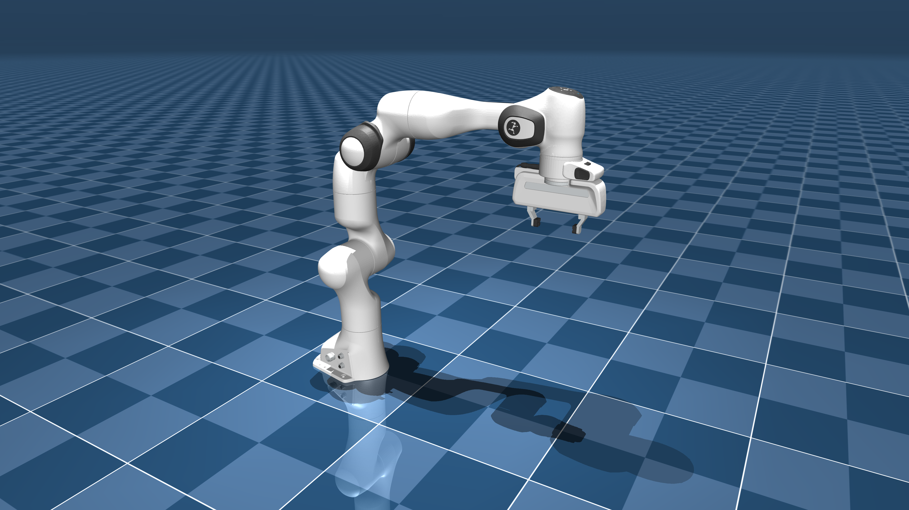
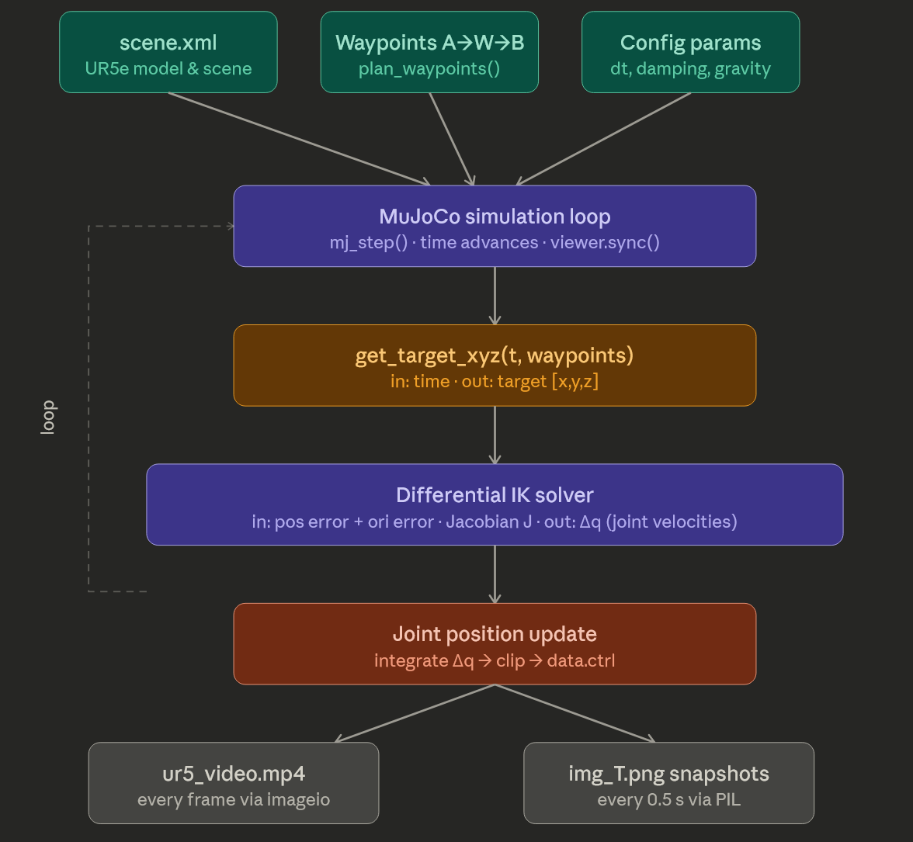
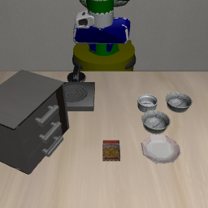
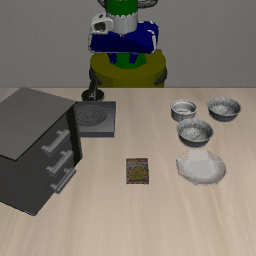
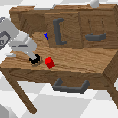
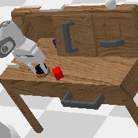

# Tabletop Robot VQA Control

A minimal example of controlling a tabletop robotic manipulation task using a **Vision-Language Model (VLM)** through **Visual Question Answering (VQA)**.

The robot observes the scene, answers structured questions about the environment, and converts those answers into executable actions.

## Robot



## Idea

1. Capture an image of the scene.
2. Ask the VLM task-relevant questions.
3. Convert the answer into a structured state.
4. Plan an action.
5. Execute with the robot controller.
6. Repeat until the task is completed.

## Example Loop

```python
img = camera.capture()

question = "Is the red block inside the bowl?"
answer = vlm.ask(img, question)

state = parse(answer)
action = policy(state)

robot.execute(action)
```

## Applications

* Tabletop manipulation
* Pick-and-place tasks
* Spatial reasoning experiments
* VLM-based robot planning


## UR5 Null Space Control


Implements differential inverse kinematics with null space control on a UR5e arm in MuJoCo. The end-effector tracks a waypoint trajectory while avoiding a spherical obstacle, with joint velocities solved via a damped pseudoinverse Jacobian.

## LIBERO Benchmark

Baseline setup for the [LIBERO](https://github.com/Lifelong-Robot-Learning/LIBERO) manipulation benchmark, with a pluggable VLM/VLA rollout loop. See [baseline/LIBERO/](baseline/LIBERO/) for setup, scripts, and details.

 

## CALVIN Benchmark

Baseline setup for the [CALVIN](https://github.com/mees/calvin) long-horizon, language-conditioned manipulation benchmark, with the same pluggable VLM/VLA rollout loop. See [baseline/CALVIN/](baseline/CALVIN/) for setup, scripts, and details.

 

## VLA Evaluation

A shared `Policy` interface plus wrappers for OpenVLA, SmolVLA, pi0/pi0.5, RT-1, Octo, RT-2, and CoT-VLA, evaluated on the LIBERO and CALVIN baselines above. OpenVLA (real 7B, LIBERO-finetuned checkpoint), SmolVLA, and RT-1 (a stateful `tf_agents` checkpoint with real Universal Sentence Encoder instruction embeddings) are actually validated with real weights, each in its own venv (`vla_venv`/`vla_venv_lerobot`/`vla_venv_tf` - different, conflicting framework/torch-version requirements); the rest are wired up with correct loading code but not executed here (a fourth framework, multi-GB checkpoints, or no public weights at all). See [baseline/Models/](baseline/Models/) for the eval harness, per-model status, and sample results.
