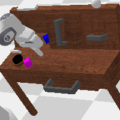
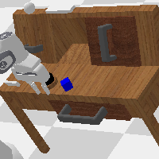

# CALVIN Baseline

Minimal working setup for the [CALVIN](https://github.com/mees/calvin) long-horizon, language-conditioned manipulation benchmark, plus a pluggable VLM/VLA rollout loop.

## Files

| File | What it does |
|---|---|
| [`CALVIN.py`](CALVIN.py) | Lists the 4 CALVIN scenes (A/B/C/D), then instantiates a real PyBullet env for one task in each, steps it a few times, and saves one rendered frame per scene. |
| [`calvin_vla_rollout.py`](calvin_vla_rollout.py) | Runs a full episode on one CALVIN task through a policy interface (`get_action(image, instruction) -> action`), saves the rollout as a GIF. Ships with a random-action `DummyPolicy` (no weights needed) and an `OpenVLAPolicy` you can enable once you have a GPU + model weights. |

## Environment setup

CALVIN uses PyBullet (not MuJoCo) and Hydra for config, which is lighter on version pinning than LIBERO. Installed into the same `vla_venv/` at the repo root used for the LIBERO baseline:

```bash
source vla_venv/bin/activate

# calvin_env's own deps
pip install gitpython hydra-core hydra-colorlog numpy-quaternion omegaconf pandas pybullet rich

# CALVIN itself: cloned outside the repo, like LIBERO
git clone --recurse-submodules https://github.com/mees/calvin.git ~/calvin_repo
echo "$HOME/calvin_repo/calvin_env" > vla_venv/lib/python3.12/site-packages/calvin_env_src.pth
```

Only `calvin_env` (the simulation package) is installed — `calvin_models` (CALVIN's own training code) pins `torch==1.13.1` and other versions that would clash with the LIBERO/OpenVLA stack already in `vla_venv`, and isn't needed to just step the env with your own policy.

Unlike LIBERO/MuJoCo, no `MUJOCO_GL` env var is needed — CALVIN renders headless via PyBullet's built-in software renderer (`use_egl=False`) by default, so it works without a GPU. Pass `use_egl=True` in the env config for faster GPU-accelerated rendering.

## Running

```bash
cd VLM-VQA-Embodied-Control
vla_venv/bin/python baseline/CALVIN/CALVIN.py

# rollout with the random-action DummyPolicy (no model weights needed)
vla_venv/bin/python baseline/CALVIN/calvin_vla_rollout.py --policy dummy

# rollout with a real VLA (OpenVLA), on a machine with a GPU
pip install "transformers==4.40.1" "tokenizers==0.19.1" "timm==0.9.10" "accelerate==0.25.0"
vla_venv/bin/python baseline/CALVIN/calvin_vla_rollout.py \
    --policy openvla --model-id openvla/openvla-7b --unnorm-key bridge_orig --device cuda \
    --scene calvin_scene_D --task lift_red_block_table --n-steps 50
```

Both scripts write to [`outputs/`](outputs). `calvin_vla_rollout.py --help` lists all flags (`--scene`, `--task`, `--n-steps`, `--model-id`, `--unnorm-key`, `--device`).

## Integrating a VLM/VLA policy

The `Policy` interface (and every VLA wrapper) lives in [`baseline/Models/VLAs.py`](../Models/VLAs.py), shared with the LIBERO baseline:

```python
class Policy:
    def get_action(self, image: np.ndarray, instruction: str) -> np.ndarray:
        ...  # return a 7-dim action: [dx, dy, dz, drx, dry, drz, gripper]
```

`image` is a rendered `(H, W, 3)` `uint8` frame from `env.render(mode="rgb_array")`, `instruction` is a plain-English stand-in for the CALVIN task name (see `TASK_TO_INSTRUCTION` — the real benchmark pairs each task with crowd-sourced language annotations shipped separately with `calvin_models`). Any VLM/VLA wrapped into that one method plugs straight into `rollout()`.

`OpenVLAPolicy` is the same wrapper used in the LIBERO baseline. OpenVLA isn't released with a CALVIN-specific action head, so `--unnorm-key` should point at whichever dataset your fine-tuned checkpoint was trained on (defaults to `bridge_orig`, a generic OpenX manipulation dataset).

See [`baseline/Models/README.md`](../Models/README.md) for the full set of VLAs wired up (SmolVLA, pi0/pi0.5, Octo, RT-1/RT-2, CoT-VLA) and the multi-model `eval.py` harness that sweeps success rate across both LIBERO and CALVIN.

## Sample output

Frames from `CALVIN.py` (one task per scene):

| calvin_scene_A | calvin_scene_C | calvin_scene_D |
|---|---|---|
|  |  |  |

Rollout from `calvin_vla_rollout.py` (`DummyPolicy`, random actions — replace with a real VLA for a coherent trajectory):


