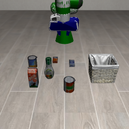
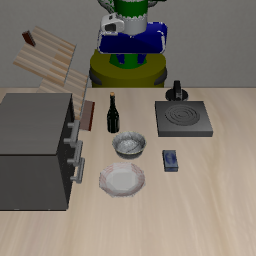

# LIBERO Baseline

Minimal working setup for the [LIBERO](https://github.com/Lifelong-Robot-Learning/LIBERO) manipulation benchmark, plus a pluggable VLM/VLA rollout loop.

## Files

| File | What it does |
|---|---|
| [`LIBERO.py`](LIBERO.py) | Lists all task suites, then instantiates a real MuJoCo env for task 0 of `libero_spatial`, `libero_object`, `libero_goal`, `libero_10`, steps it a few times, and saves one rendered frame per suite. |
| [`libero_vla_rollout.py`](libero_vla_rollout.py) | Runs a full episode on one LIBERO task through a policy interface (`get_action(image, instruction) -> action`), saves the rollout as a GIF. Ships with a random-action `DummyPolicy` (no weights needed) and an `OpenVLAPolicy` you can enable once you have a GPU + model weights. |

## Environment setup

LIBERO needs MuJoCo + robosuite, which are picky about versions on Python 3.12. This was set up once in `vla_venv/` at the repo root:

```bash
python3 -m venv vla_venv
source vla_venv/bin/activate

# LIBERO's own deps (unpinned versions where the pin has no py3.12 wheel)
pip install robosuite==1.4.0 bddl==1.0.1 opencv-python termcolor numba scipy Pillow \
            future easydict matplotlib gym einops cloudpickle pyyaml

# mujoco 2.3.x has no py3.12 wheel; 3.0.1 is the closest version that works with robosuite 1.4.0
pip install "mujoco==3.0.1"

# torch>=2.6 changed torch.load's default (weights_only=True), which breaks
# LIBERO's init-state loading -> pin below 2.6
pip install "torch<2.6" --index-url https://download.pytorch.org/whl/cpu

# LIBERO itself: cloned outside the repo (it's ~640MB of upstream assets)
git clone https://github.com/Lifelong-Robot-Learning/LIBERO.git ~/libero_repo
echo "$HOME/libero_repo" > vla_venv/lib/python3.12/site-packages/libero_src.pth
```

`libero.libero`'s first import writes `~/.libero/config.yaml` pointing at its own `bddl_files`/`init_files`/`assets` dirs under `~/libero_repo` — this repo doesn't need to touch that file again once it exists.

Rendering is headless (no display attached), so every run needs:

```bash
export MUJOCO_GL=egl
```

## Running

```bash
cd VLM-VQA-Embodied-Control
MUJOCO_GL=egl vla_venv/bin/python baseline/LIBERO/LIBERO.py

# rollout with the random-action DummyPolicy (no model weights needed)
MUJOCO_GL=egl vla_venv/bin/python baseline/LIBERO/libero_vla_rollout.py --policy dummy

# rollout with a real VLA (OpenVLA), on a machine with a GPU
# transformers>=5 removed AutoModelForVision2Seq (OpenVLA's remote code needs it) - pin to the versions OpenVLA was built against
pip install "transformers==4.40.1" "tokenizers==0.19.1" "timm==0.9.10" "accelerate==0.25.0"
MUJOCO_GL=egl vla_venv/bin/python baseline/LIBERO/libero_vla_rollout.py \
    --policy openvla --model-id openvla/openvla-7b-finetuned-libero-spatial --device cuda \
    --suite libero_spatial --task-id 0 --n-steps 50
```

Both scripts write to [`outputs/`](outputs). `libero_vla_rollout.py --help` lists all flags (`--suite`, `--task-id`, `--n-steps`, `--model-id`, `--device`).

## Integrating a VLM/VLA policy

The `Policy` interface (and every VLA wrapper) lives in [`baseline/Models/VLAs.py`](../Models/VLAs.py), shared with the CALVIN baseline:

```python
class Policy:
    def get_action(self, image: np.ndarray, instruction: str) -> np.ndarray:
        ...  # return a 7-dim action: [dx, dy, dz, droll, dpitch, dyaw, gripper]
```

`image` is the `agentview_image` frame (H, W, 3) `uint8`, `instruction` is `task.language` from the benchmark (e.g. `"pick up the black bowl between the plate and the ramekin and place it on the plate"`). Any VLM/VLA that can be wrapped into that one method plugs straight into `rollout()`.

`OpenVLAPolicy` is a concrete example (HuggingFace `transformers`, `predict_action(...)`, defaults to the LIBERO-spatial-finetuned checkpoint). Select it from the CLI with `--policy openvla` (see [Running](#running) above), or instantiate it directly:

```python
policy = OpenVLAPolicy(unnorm_key="libero_spatial")  # instead of DummyPolicy()
```

See [`baseline/Models/README.md`](../Models/README.md) for the full set of VLAs wired up (SmolVLA, pi0/pi0.5, Octo, RT-1/RT-2, CoT-VLA) and the multi-model `eval.py` harness that sweeps success rate across both LIBERO and CALVIN.

## Sample output

Frames from `LIBERO.py` (task 0 of each suite):

| libero_spatial | libero_object | libero_goal |
|---|---|---|
|  |  |  |

Rollout from `libero_vla_rollout.py` (`DummyPolicy`, random actions — replace with a real VLA for a coherent trajectory):


